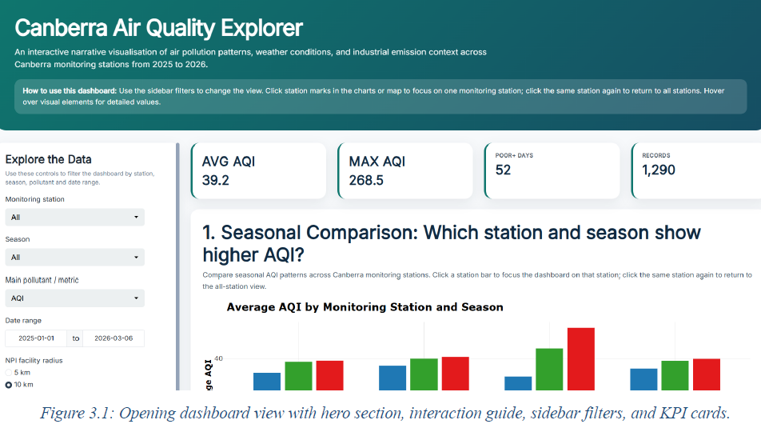
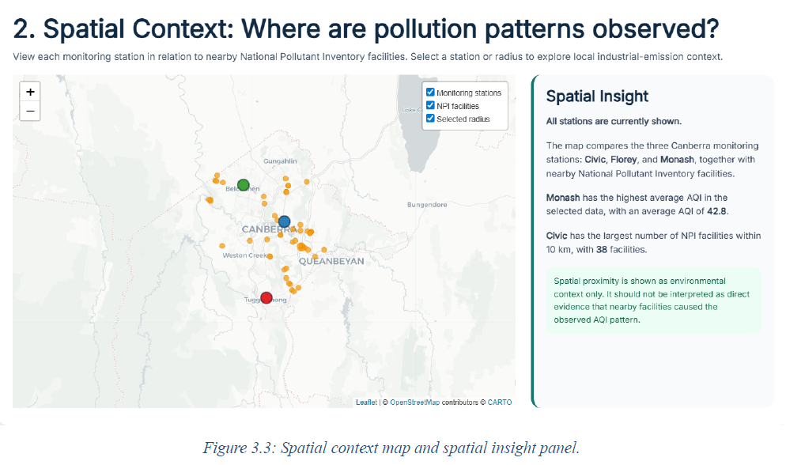
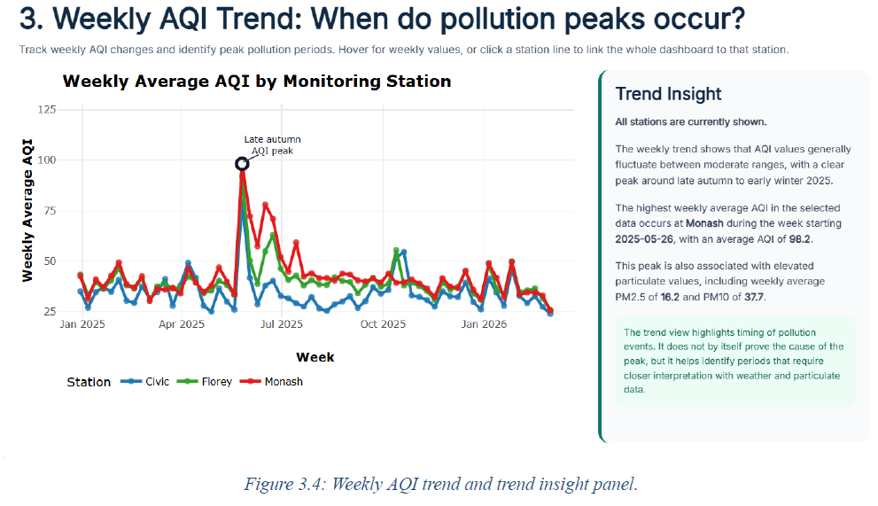
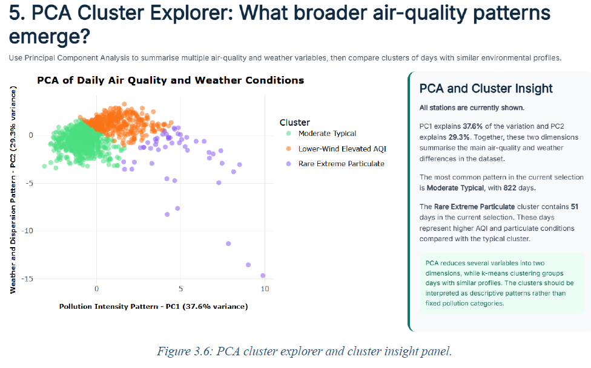

# 🌏 Canberra Air Quality Explorer

An interactive environmental data analytics project exploring **air pollution patterns across Canberra during 2025–2026** by integrating air-quality measurements, historical weather observations, and nearby industrial emission facilities.

The project combines **data wrangling, exploratory data analysis, spatial analytics, interactive visualisation, PCA, and clustering** within an interactive **R Shiny dashboard**.

> **Tech Stack:** Python · R · R Shiny · ggplot2 · Plotly · Leaflet · Tableau · PCA · Clustering · Data Wrangling · Spatial Analysis

---

## 📌 Project Overview

Air quality can vary significantly across locations and over time due to seasonal conditions, weather patterns, and surrounding pollution sources.

This project investigates air-quality behaviour across three Canberra monitoring stations:

- **Civic**
- **Florey**
- **Monash**

Air-quality observations were combined with historical weather measurements and spatial information about facilities from Australia's **National Pollutant Inventory (NPI)**.

The resulting dataset was used to investigate:

1. How air pollution varies across monitoring stations and seasons.
2. How air-quality patterns change over time and under different weather conditions.
3. What broader environmental patterns emerge when air-quality and weather variables are analysed together.

---

## 🎯 Project Objectives

The project was designed to:

- Integrate environmental datasets from multiple sources.
- Clean and transform raw air-quality, weather, and spatial data.
- Compare AQI patterns between monitoring stations and seasons.
- Explore the geographic context of monitoring stations and nearby NPI facilities.
- Investigate relationships between weather conditions and pollution.
- Identify recurring air-quality conditions using multivariate analysis.
- Present the results through an interactive R Shiny dashboard.

---

## 📊 Data Sources

### 1. ACT Air Quality Monitoring Data

Air-quality measurements collected from monitoring stations across Canberra.

The original dataset contained approximately **371,000 observations** with measurements including:

- AQI
- PM2.5
- PM10
- NO₂
- O₃
- Monitoring station
- Date and time
- Geographic information

For this project, the data was restricted to **January 2025 – March 2026** and the Civic, Florey, and Monash monitoring stations.

**Source:** ACT Government — Air Quality Monitoring Data

### 2. Historical Weather Data

Daily weather observations for Canberra Airport were used to investigate relationships between atmospheric conditions and pollution.

Variables included:

- Average temperature
- Minimum temperature
- Maximum temperature
- Precipitation
- Wind speed
- Atmospheric pressure

**Source:** Meteostat — Canberra Airport

### 3. National Pollutant Inventory

Facility-location data from Australia's National Pollutant Inventory was used to provide spatial context around the air-quality monitoring stations.

Relevant attributes included:

- Facility name
- Industry type
- Suburb
- Latitude
- Longitude

The data was filtered to facilities relevant to the ACT/Canberra region.

**Source:** Australian Government — National Pollutant Inventory

---

## 🔄 Data Preparation

The raw datasets differed significantly in structure, temporal resolution, and geographic coverage.

A data-wrangling workflow was therefore used to create a consistent analytical dataset.

### Filtering

The air-quality dataset was restricted to:

- January 2025 – March 2026
- Civic
- Florey
- Monash

The National Pollutant Inventory data was filtered to facilities relevant to Canberra and the ACT.

### Cleaning

The datasets were checked for:

- Duplicate station/date records
- Missing values
- Invalid pollution measurements
- Inconsistent station names
- Incorrect date-derived fields
- Unrealistic environmental measurements

Potentially meaningful extreme pollution observations were retained rather than automatically removing them as outliers.

### Temporal Transformation

The final dataset was standardised to approximately:

**one observation per monitoring station per day**

Additional temporal features were derived, including:

- Year
- Month
- Season
- Weekend indicator

### Spatial Processing

Monitoring-station coordinates were combined with National Pollutant Inventory facility information.

Derived spatial features included:

- Closest NPI facility
- Number of facilities within **5 km**
- Number of facilities within **10 km**

This allowed air-quality behaviour to be explored alongside the industrial context surrounding each monitoring location.

---

## 🖥️ Interactive R Shiny Dashboard

The final analysis is presented through an interactive **R Shiny application**.

The dashboard was designed as an exploratory interface rather than a collection of static charts.

Users can interact with monitoring stations and filters to investigate different environmental conditions.

### Dashboard Features

- Interactive filtering
- Monitoring-station selection
- AQI KPI summaries
- Seasonal AQI comparisons
- Weekly AQI trends
- Interactive Leaflet map
- Nearby NPI facility exploration
- Weather–pollution relationship plots
- PCA visualisation
- Cluster profiles
- Narrative insight panels
- Summary and takeaway sections

Several visualisations also support **linked station interaction**.

Selecting a monitoring station can update other components of the dashboard, allowing users to progressively explore the data.

---

## 📈 Analysis

### Seasonal AQI Patterns

Average AQI was compared across Civic, Florey, and Monash for each season.

The analysis showed clear differences between both monitoring locations and seasons.

**Key observation:**

> Monash experienced the strongest deterioration in average AQI during winter.

This indicates that pollution behaviour is not spatially uniform across Canberra.

---

### 🗺️ Spatial Analysis

An interactive map was created using **Leaflet** to visualise:

- Air-quality monitoring stations
- Nearby National Pollutant Inventory facilities
- Spatial differences between station environments

The spatial analysis showed that each monitoring station exists within a different surrounding industrial context.

These geographic patterns provide additional context for interpreting differences in observed air quality.

The analysis is exploratory and does **not** claim that proximity to an NPI facility directly causes higher AQI.

---

### 📅 Weekly AQI Trends

Weekly AQI trends were analysed across the three monitoring stations.

The stations generally followed similar temporal patterns, but differences emerged during elevated pollution periods.

A notable increase occurred around **late autumn to early winter 2025**.

During several elevated periods, **Monash and Florey recorded higher AQI levels than Civic**.

---

### 🌡️ Temperature vs AQI

Scatter plots and station-level trend lines were used to investigate the relationship between average temperature and AQI.

The analysis indicated a relatively weak relationship.

Most observations remained within moderate AQI conditions across a wide range of temperatures.

Greater AQI variability was observed at lower temperatures, but temperature alone did not provide a strong explanation for AQI variation.

---

### 💨 Wind Speed vs PM2.5

A clearer relationship emerged between **wind speed and PM2.5 concentrations**.

Across the monitoring stations, trend lines generally decreased as wind speed increased.

This suggests an inverse relationship:

> Higher PM2.5 concentrations were more commonly observed during lower-wind conditions.

Calmer atmospheric conditions may therefore be associated with reduced particulate dispersion.

---

## 🧠 PCA & Cluster Analysis

To investigate broader environmental patterns, the project applied **Principal Component Analysis (PCA)** to the combined air-quality and weather variables.

Variables included:

- AQI
- PM2.5
- PM10
- O₃
- Temperature
- Wind speed
- Atmospheric pressure

Because these variables operate on different scales, they were standardised before multivariate analysis.

The analysis identified **three broader environmental regimes**.

### 🟢 Moderate Typical

Conditions close to the average values across most air-quality and weather variables.

These represent relatively typical daily environmental conditions.

### 🟠 Lower-Wind Elevated AQI

Characterised by:

- Lower wind speeds
- Elevated AQI

This pattern supports the earlier observation that lower-wind conditions can coincide with poorer air quality.

### 🔴 Rare Extreme Particulate

A smaller group containing unusually high particulate and AQI observations.

These represent rare but significant pollution events within the analysed period.

---

## 🔍 Key Findings

The analysis produced several notable observations:

- Air quality varied across both **monitoring station and season**.
- **Monash recorded the strongest winter AQI deterioration** among the analysed stations.
- Monitoring stations were surrounded by different concentrations and distributions of NPI facilities.
- Canberra experienced a noticeable AQI increase around **late autumn and early winter 2025**.
- Temperature showed only a **weak relationship with AQI**.
- Wind speed showed a clearer **inverse relationship with PM2.5**.
- PCA and clustering identified recurring environmental states ranging from typical conditions to rare extreme particulate events.

Together, these findings demonstrate how combining spatial, temporal, meteorological, and pollution data can provide a more complete view of urban air-quality behaviour.

---

## 🛠️ Technologies Used

| Area | Technologies |
|---|---|
| Data Wrangling | Python, Excel |
| Data Analysis | R |
| Interactive Application | R Shiny |
| Visualisation | ggplot2, Plotly |
| Spatial Visualisation | Leaflet |
| Dashboard Exploration | R Shiny, Tableau |
| Data Manipulation | dplyr, tidyr, readr |
| Time-Series Processing | lubridate |
| Multivariate Analysis | PCA, Clustering |
| Interactive Components | shinyWidgets, bslib, networkD3, htmlwidgets |

---

## 📁 Repository Structure

```text
canberra-air-quality-explorer/
│
├── README.md
├── .gitignore
│
├── app/
│   ├── global.R
│   ├── ui.R
│   ├── server.R
│   │
│   └── www/
│       └── style.css
│
├── data/
│   ├── final_wrangled_dataset_2025_2026.csv
│   ├── npi_act_cleaned.csv
│   └── station_facility_links_within_10km.csv
│
├── scripts/
│   └── plotting.R
│
├── docs/
│   └── canberra-air-quality-analysis-report.pdf
│
└── images/
    ├── dashboard-overview.png
    ├── spatial-analysis.png
    ├── weekly-aqi-trends.png
    └── pca-clusters.png
```

---

## 🚀 Running the Dashboard Locally

### 1. Clone the repository

```bash
git clone <repository-url>
cd canberra-air-quality-explorer
```

### 2. Open the project in RStudio

Ensure that R is installed along with the packages required by the application.

Major dependencies include:

```text
shiny
shinyWidgets
bslib
dplyr
readr
lubridate
ggplot2
plotly
leaflet
scales
tidyr
networkD3
htmlwidgets
```

### 3. Start the application

Open the Shiny application files in RStudio and run the application.

> **Note:** The exact working-directory configuration depends on the final repository structure. Update the data paths in `global.R` if the application files are stored inside the `app/` directory.

---

## 📸 Dashboard Preview

### Interactive Air Quality Explorer



### Spatial Analysis of Monitoring Stations & NPI Facilities



### Weekly AQI Patterns



### PCA & Environmental Clusters



---

## 💡 Skills Demonstrated

This project demonstrates practical experience in:

- Data cleaning and preprocessing
- Multi-source data integration
- Exploratory data analysis
- Environmental data analytics
- Time-series exploration
- Geospatial analysis
- Interactive dashboard development
- Data visualisation
- PCA and dimensionality reduction
- Clustering
- Communicating analytical findings
- Building user-driven exploratory interfaces

---

## 🔮 Future Improvements

Potential extensions include:

- Incorporating traffic-volume data
- Adding more granular industrial-emission measurements
- Expanding the analysis to additional ACT monitoring stations
- Investigating longer-term seasonal trends
- Adding statistical modelling for pollution-event prediction
- Deploying the Shiny dashboard publicly
- Automating ingestion of updated environmental data

---

## 👤 Author

**Ajay Sundar Ramanathan**

Master of Data Science  
Monash University · Melbourne, Australia

[LinkedIn](https://www.linkedin.com/in/ajay-sundar2909) · [GitHub](https://github.com/Ajay-Sundar)

---

## 📚 Data Attribution

This project uses environmental data from:

- **ACT Government — Air Quality Monitoring Data**
- **Meteostat — Historical Weather Data**
- **Australian Government Department of Climate Change, Energy, the Environment and Water — National Pollutant Inventory**

Please refer to the respective data providers for licensing, attribution requirements, and terms of use.